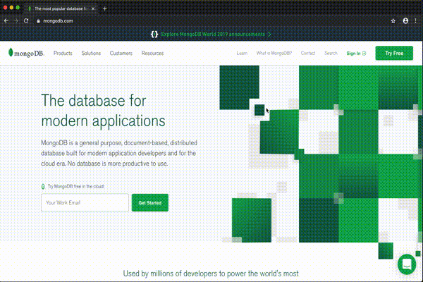

# MongoDB's Navbar
The goal of this project was to recreate [MongoDB's NavBar](https://www.mongodb.com/) animation. I wouldn't say I'm 100% successful in this, however the animation without the extra keyframes to add the "wiggle" effect, is pretty close.

## Side by side comparison
MongoDB's original navbar | This repo's implementation
:-------------------------:|:-------------------------:
  |  

## Implementation 
The navbar makes use of some [Bootstrap](https://getbootstrap.com) helper classes. Javascript is all completely vanilla 🎉.

## Contributing
If you're willing to improve on what I made here, feel free to fork this repo and add your changes. I'll gladly review any pull requests.